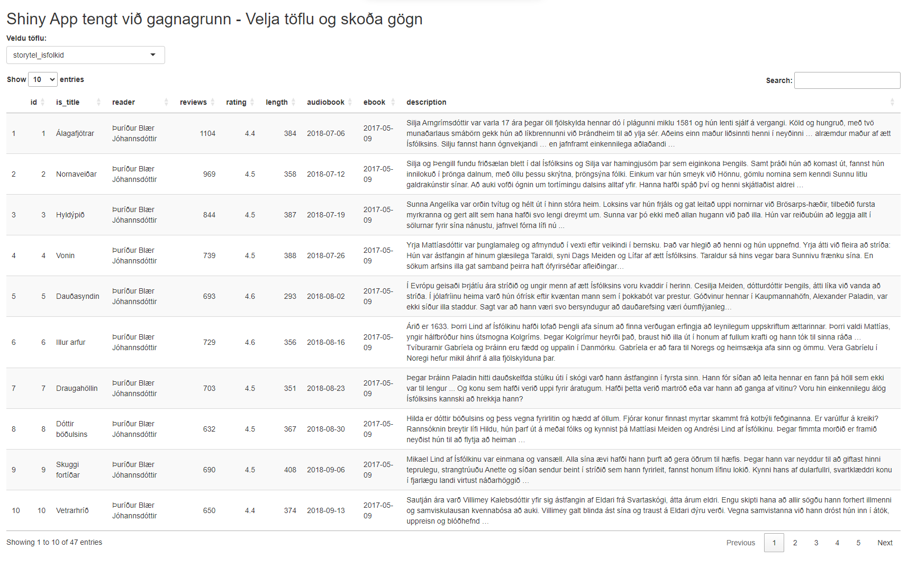

# Gangvirk mælaborð

Gangvirk mælaborð eru áhrifarík leið til að sýna gögn og veita notendum innsýn í flókin gagnasöfn á
auðveldan og gagnvirkan hátt. Með þeim er hægt að skoða gögn í rauntíma, greina mynstur og sýna
lykilupplýsingar eftir þörfum notandans. Hér eru nokkur algeng verkfæri til að búa til gagnvirk
mælaborð og helstu kostir og gallar hvers og eins.

## Shiny (R-pakki)

_Shiny_ er sveigjanlegt tól fyrir notendur R sem býður upp á mikla möguleika til að búa til
sérsniðin mælaborð. Kosturinn við Shiny er einföld tenging við _R_-kóða og gagnavinnslu, sem gerir
það auðvelt að vinna með stór gögn og búa til gagnvirk mælaborð án þess að þurfa að yfirgefa
_R_-umhverfið. Gallinn er að notendur þurfa að hafa þekkingu á _R_-forritun, og það getur verið
flóknara að setja upp en tilbúin verkfæri.

Nánar um [Shiny](https://shiny.rstudio.com/) og hvernig hægt er að byrja að nota það.

## Power BI

_Power BI_ er notendavænt tól frá Microsoft sem er mikið notað í fyrirtækjum til að búa til mælaborð
og greina gögn. Það er einfalt í uppsetningu og samþættist vel við Microsoft-vörur. Kosturinn er að
það býður upp á öfluga greiningarmöguleika, en gallinn er að _Power BI_ er ekki í boði fyrir Mac eða
Linux og ókeypis útgáfan er með takmarkaða möguleika.

Nánar um [Power BI](https://powerbi.microsoft.com/).

## Tableau

_Tableau_ er öflugt tól fyrir sjónræna framsetningu gagna og veitir mikla möguleika til að búa til
gangvirk mælaborð. Það er frábært fyrir notendur með litla forritunarreynslu, en gallinn er að
leyfisgjöldin geta verið há og möguleikarnir á að aðlaga mælaborðið eru takmarkaðir miðað við opnari
kerfi.

Nánar um [Tableau](https://www.tableau.com/).

## Grafana

Grafana er opinn hugbúnaður sem er mest notaður fyrir eftirlit með kerfum og gagnagreiningu með
tímaraðargögnum. Það er frítt og býður upp á mikla möguleika til að tengjast við ýmsa gagnagrunna,
en það krefst meiri tæknilegrar þekkingar en önnur tól.

Nánar um [Grafana](https://grafana.com/).

---

## Einfalt dæmi um Shiny App tengt við gagnagrunn

Til að sýna hvernig Shiny getur verið notað til að tengjast gagnagrunni, höfum við hér einfalt dæmi
þar sem við tengjumst _SQLite_ gagnagrunni og sýnum gögn á mælaborði.

```r
# Hlaða inn nauðsynlegum pökkum
library(shiny)
library(DBI)
library(RSQLite)
library(DT)

# Búa til tengingu við SQLite gagnagrunn
con <- dbConnect(RSQLite::SQLite(), "../data/isfolkid.db")

# Sækja nöfn töflna úr gagnagrunninum
tables <- dbListTables(con)

# Shiny UI (notendaviðmót)
ui <- fluidPage(
  titlePanel("Shiny App tengt við gagnagrunn - Velja töflu og skoða gögn"),

  # Dropdown til að velja töflu
  selectInput("table_choice", "Veldu töflu:", choices = tables),

  # Searchable table output með DT
  DTOutput("table")
)

# Shiny Server (bakviðmót)
server <- function(input, output, session) {

  # Útdráttur gagna úr valinni töflu
  data_selected <- reactive({
    req(input$table_choice) # Gakktu úr skugga um að tafla hafi verið valin
    dbGetQuery(con, paste("SELECT * FROM", input$table_choice))
  })

  # Birta gagnatöflu sem er searchable og sortable
  output$table <- renderDT({
    datatable(data_selected(), options = list(pageLength = 10, searchHighlight = TRUE))
  })
}

# Keyra appið
shinyApp(ui = ui, server = server)
```

> Fyrst þarf að ganga úr skugga að viðeigandi R-pakkar séu settir upp áður en kóðinn er keyrður.
> Það er hægt að setja upp pakka með
> ```R 
> install.packages(c("shiny", "DBI", "RSQLite", "tidyverse", "DT"))
> ``` 
> innan úr R.

Skráin myndi heita [app.R](../code/app.R) og vera í möppu sem heitir til dæmis `shiny_app` og á
sama stað væri gagnamappan vera `data` sem inniheldur gagnagrunninn
[`isfolkid.db`](../data/isfolkid.db). Við keyrum upp appið úr kóða möppunni með skeljarskipuninni:

```bash
Rscript -e "shiny::runApp('.')"
```

Úttakið væri þá t.d.:

``` 
Loading required package: shiny

Listening on http://127.0.0.1:5073
```

Ef þið skoðið slóðina sem kemur upp, en hún sem vísar í [`localhost`](http://127.0.0.1) og svo
port númer sem getur verið mismunandi milli keyrsla. Opnið hana í vafra, og þá myndið þá sjá
einfalt mælaborð með gögn úr gagnagrunninum og lítur svona út:



Þetta er einfalt dæmi um hvernig hægt er að draga fram gögn úr _SQLite_ gagnagrunni og sýna þau í
mælaborði með _Shiny_. Nánar um hvernig hægt er að nota
[Shiny með gagnagrunnum](https://www.r-bloggers.com/2022/01/using-databases-with-shiny/) en
munið að setja hvergi lykilorð eða aðra trúnaðarupplýsingar í forritskóðann.

## Búa til sitt eigið Shiny mælaborð

Að búa til sitt eigið _Shiny_ mælaborð er einfalt og hægt er að byrja á að skoða [opinberu 
heimasíðu _Shiny_](https://shiny.posit.co/). En til að taka ykkar allra fyrstu skref, þá er best 
að fylgja [þessum upphafs leiðbeiningum](https://shiny.posit.co/getstarted.html) sem er bæði til 
fyrir `R` og `Python` notendur. 

> _Shiny_ var upphaflega hannað fyrir `R` notendur en er núna aðeins að opna fyrir `Python` notendur
> með `ShinyPy` pakkann. Þar sem _Shiny_ öpp eru sérstaklega falleg með `ggplot2` myndum (og 
> hefur verið notað í undangengnum sýnidæmum) þá verður hér stuðst við `R` sýnidæmi. Ykkur er þó 
> frjálst að prófa með `Python` ef þið hafið meiri reynslu með það forritunarmál.

### Shiny Gallery 

Hægt er að skoða alls kyns _Shiny_ mælaborð á [Shiny Gallery](https://shiny.posit.co/r/gallery/)
sem eru búin til af fólki úr samfélaginu. Hægt er að keyra upp mælaborðin í vafra og skoða
undirliggjandi kóða.

### Shiny Layouts

Hægt er að setja upp mismunandi útlit á _Shiny_ síðum með 
[Shiny Layouts](https://shiny.posit.co/r/layouts/). 

Mögulega viljið þið taka skrefið lengra og nota mælaborð og þá fjallar 
[Shiny Dashboards](https://shiny.posit.co/r/articles/build/dashboards/index.html) hvernig hægt 
er að nota pakkana `flexdashboard` eða `shinydashboard` til að búa til sérhæfðari mælaborð.  

### Ítarefni

Bókin [Mastering Shiny](https://mastering-shiny.org/) er opin og frí kennslubók eftir Hadley Wickham
og gefur ítarlegar leiðbeiningar um hvernig hægt er að nota _Shiny_ til að búa til gegnvirk 
mælaborð.