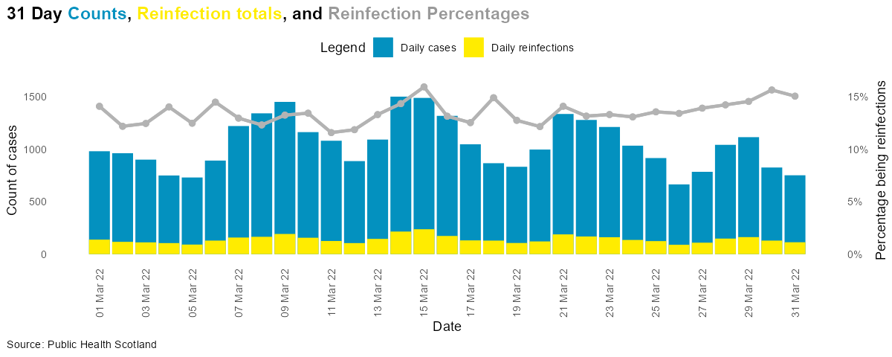
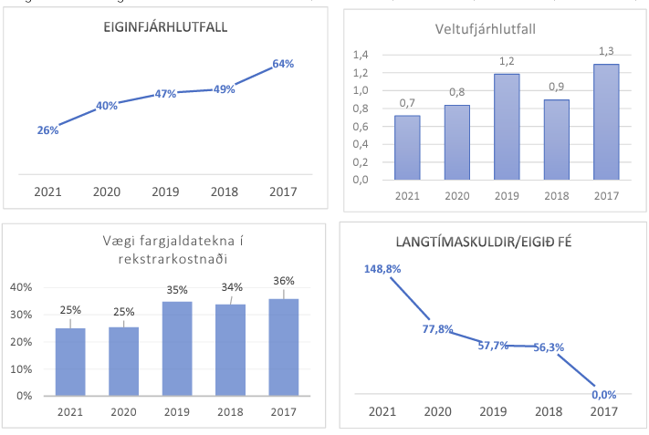

# Slæm notkun á gröfum

## Kleinuhringjarit

Kleinuhringjarit ætti að forðast eins og heitan eldinn. Þau eru enn erfiðari fyrir augað að greina
en skífurit, þar sem lesandinn þarf að bera saman arc-lengdir, sem er flóknara en að bera saman horn
eða svæði. Að reyna að meta hver er munurinn á tveimur arc-lengdum getur valdið misskilningi og er
mjög óskilvirkt. Hins vegar ætti einnig að reyna að forðast skífurit almennt, nema í sértækum
tilfellum þar sem hlutfallsleg tengsl hluta við heild skipta mestu máli, þar sem þau geta einnig
verið ruglingsleg og lítið gefandi þegar flóknari samanburðir eru nauðsynlegir.

---

## 3D gröf

3D gröf ætti að forðast þegar kemur að gagnamiðlun. Þau bæta oft ekki við upplýsingarnar sem verið
er að sýna og geta í raun ruglað lesendur með óþarfa sjónrænum áhrifum og flækjum. Sjónræn dýpt í
slíkum gröfum getur gert það erfiðara að túlka gögnin rétt og leitt til rangra ályktana, sérstaklega
þegar flokkarnir verða óskýrir eða óviðkomandi dýpt bætist við.

Í eftirfarandi mynd
frá [Kópavogs- og Garðapóstinum](https://kgp.is/gardabaer/70-ibua-undir-40-ara-i-urridaholti/)
má sjá dæmi af þrívíðu súluriti fyrir íbúasamsetningu í Garðabæ. Í þessu tilviki væri betra að
fella út þrívíddina og einfalda grafið.

Sama graf, án óþarfa þrívíddar:

**Kostir:**

- Getur verið notað í stærðfræði greiningu, en þetta á ekki við um gagnamiðlun.

**Gallar:**

- Ruglingsleg framsetning fyrir flesta notendur.
- Óþarfa sjónræn truflun.
- Flokkar geta litið út fyrir að vera stærri eða minni en þeir eru í raun.

---

## Tvöfaldur Y-ás

Tvöfaldur Y-ás veldur oft ruglingi þar sem það getur tekið lesandann tíma að átta sig á hvaða Y-ás
tilheyrir hvaða gögnum. Ef tvö gögn eru sýnd saman á sama grafi er mikilvægt að gera það skýrt og
aðgengilegt.

Hér kemur dæmi um hvernig tvöfaldur y-ás getur valdið misskilningi hjá lesendum og er oft ekki besta
lausnin fyrir gagnamiðlun. Myndin er byggð frá bloggfærslu
[John Mackintosh](https://johnmackintosh.net/blog/2022-03-13-dual-axis/).

Myndin sýnir tvöfaldan y-ás, þar sem annars vegar eru dagleg tilfelli af COVID-19 sýkingum (blár
litur) og endursýkingum (gulur litur), og hins vegar sýnir grá lína og punktar hlutfall endursýkinga
sem prósentu. Þó að þetta virðist vera góð leið til að setja fram tvö ólík gagnasöfn saman í einu
grafi, er það oft ruglandi fyrir lesendur.

Ástæðan er sú að tvöfaldur y-ás krefst þess að lesandinn fylgist með tveimur mismunandi skölum
samtímis. Í þessu tilviki þarf lesandinn að skilja að bláar og gular súlur tengjast y-ásnum vinstra
megin, en grá línan tengist y-ásnum hægra megin. Þetta getur verið villandi og gert það erfiðara að
átta sig á samhengi og tengslum milli gagnanna. Tvöfaldur y-ás getur einnig ýtt undir villandi
túlkun, þar sem tvö mjög ólík gagnasöfn eru lögð saman án þess að sýna hvort þau eru raunverulega í
samhengi við hvort annað.

**Kostir:**

- Getur sýnt tvö mismunandi gagnasöfn á sama tíma.

**Gallar:**

- Ruglingslegt fyrir lesendur.
- Tekur tíma að skilja gögnin.

**Leiðir til að gera þetta aðgengilegra:**

- Ekki sýna Y-ás númer 2 – setjið frekar texta á gögnin.
- Setjið tvö gröf ofan á hvort annað með sama X-ás.
- Lita Y-ás og gögnin í sama lit.

---

## Dæmi um villandi gröf

### Graf sem byrjar ekki á 0

Graf sem byrjar ekki á 0 getur verið mjög villandi. Hér er dæmi af Fox News þar sem línurit byrjar á
34 í staðinn fyrir 0. Það veldur því að munur sem er aðeins 4% lítur út fyrir að vera mun stærri en
hann er í raun.

Söma mistök má sjá á fréttaskoti um Obamacare þátttöku. Tölurnar 6.000.000 og 7.066.000
eru settar upp á mjög villandi hátt með lóðrétta ásnum sem gefur til kynna mun meiri mun á
tölunum en er í raun.

### Villandi láréttur ás

Hér er annað dæmi frá Fox News þar sem jafnlöng bil eru notuð fyrir mismunandi tímabil á lárétta
ásnum. Þetta veldur því að síðasta ár og síðasta vika fá jafnmikið pláss á ásnum, sem gefur lesendum
þá tilfinningu að breytingin sé mun meiri en hún er í raun.

Á ársreikningi Strætó má sjá slæma notkun á láréttum ásum. Við sjáum hér nokkur gröf sem má finna á
[sjálfbærnisskýrslu Strætó 2021](https://sjalfbaerniskyrsla2021.straeto.is/efnahagur).

Hér má sjá slæma uppsetningu þar sem gildin á lárétta ásinum eru öfug miðað við eðlilega röð. Það
getur valdið því að lesandi misskilur gögnin.

Þessar myndir sýna hvernig hægt er að blekkja áhorfendur með því að spila með ásana í gröfum. Þegar
ásarnir eru ekki réttir eða sýna upplýsingar á villandi hátt, getur það leitt til rangra túlkunar
gagna.

---

## Samantekt

Það er mikilvægt að vanda til verka þegar kemur að notkun á gröfum. Slæm notkun, eins og 3D-grafík
eða graf sem hefur misvísandi ása (hvort sem það er lóðrétti eða lárétti ásinn), getur leitt til
misskilnings og villandi túlkunar. Gögn þurfa að vera sett fram á skýran og einfaldan hátt til að
auðvelda notendum að lesa og skilja upplýsingar.

