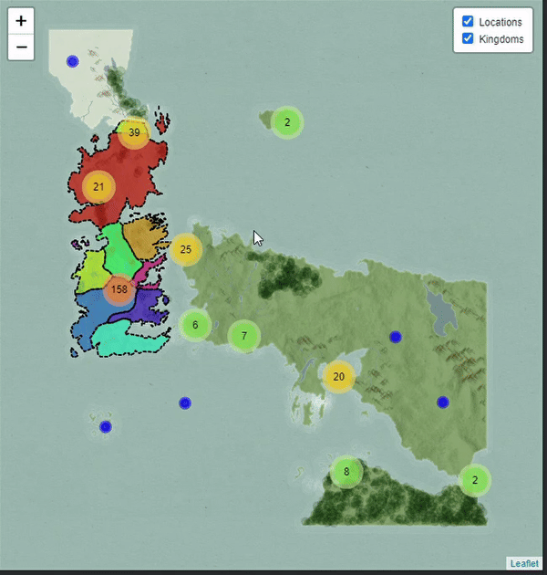

# Gangvirk gröf og kort

Gagnvirk gögn eru öflug leið til að miðla flóknum upplýsingum á auðskiljanlegan og aðgengilegan
hátt. Með gagnvirkum gröfum og kortum geta notendur skoðað gögnin á eigin forsendum, leitað að
mynstrum, stækkað og minnkað sýnina, og jafnvel fengið ítarlegri upplýsingar með smelli. Tól eins og
_Plotly_ og _Leaflet_ gera það auðvelt að búa til gagnvirkar gagnavísanir í _R_ og öðrum
forritunarmálum. Slík tól auka áhrifamátt gagnamiðlunar með því að gera gögnin sjálfskipandi,
þannig að áhorfendur geta kannað upplýsingar í rauntíma.

## Gagnvirk gröf með Plotly

_Plotly_ er eitt af vinsælustu tólin til að búa til gagnvirk gröf í _R_. Það býður upp á
margskonar gagnvirka eiginleika eins og að færast yfir gögnin og fá nánari upplýsingar (tooltips),
stækka og minnka ásana (zoom), og velja ákveðnar gagnapunkta til frekari greiningar. Með
_Plotly_ er hægt að umbreyta hefðbundnum gröfum eins og línuritum, dreifiritum og súluritum í
gagnvirk verkfæri.

Dæmi um gagnvirkt dreifirit sem sýnir aldur við dauða sögupersóna í _Game of Thrones_ heiminum
og fæðingarár þeirra er hægt að sjá hér. Þetta gagnvirka graf gerir notendum kleift að færa
músina yfir einstaka punkta til að sjá nafn sögupersónunnar, fæðingarár, aldur við andlát, og
hvaða stríð þær létust í.


kóðinn sem var notaður er:

```R 
# Hlaða inn pökkum
library(ggplot2)
library(plotly)

# Gagnasett og ggplot dreifirit (bætum nafn við fyrir tooltip)
p <- ggplot(scatter_dat,
            aes(x = year_born, y = age, color = war,
                text = paste("name:", name))) +
  geom_point(alpha = .5) +
  theme_minimal() +
  labs(
    title = 'Age at Death and Birth Years of GOT Characters',
    x = 'Year of Birth',
    y = 'Age at Death',
    color = 'War'
  ) +
  scale_fill_viridis_d() +
  # As of 2023-10-26 the easiest and cleanest way to address Plotly's known issue of adding parentheses on dummy scales is setting the respective guide/legend to none.
  guides(fill = "none")

ggplotly(p) %>%
  layout(legend = list(orientation = "h", x = 0.5, xanchor = "center", y = -0.2))
```

Einsog sést, þá er viðbótin til að gera dreifiritið gagnvirkt mjög einföld. Það er nóg að nota
`ggplotly()` fallið til að breyta _ggplot2_ dreifiritinu í gagnvirkt _Plotly_ dreifirit.

Þetta gefur notandanum meiri innsýn í gögnin án þess að flækja framsetninguna, þar sem aðeins
eru sýndar ítarupplýsingar þegar músin er færð yfir punktana.

## Fleiri dæmi um Plotly gröf

_Plotly_ býður upp á mörg önnur gagnvirk verkfæri, þar á meðal:

- **Línurit (Line Graphs)**: Gagnlegt til að sýna breytingar yfir tíma með möguleikum til að skoða
  ákveðin tímabil nánar.
- **Súlurit (Bar Charts)**: Hægt að nota til að draga fram ákveðnar flokka eða hópa, og leyfa
  notendum að velja hvað þeir vilja sjá nánar.
- **Hitasjá (Heatmaps)**: Skilvirk leið til að sýna dreifingu og styrk breytna með mismunandi
  liti og fá nánari upplýsingar um einstaka svæði.

Fleiri sýnidæmi um _Plotly_ gröf er hægt að finna í á [Plotly heimasíðunni](https://plotly.com/r/).

## Gagnvirk kort með Leaflet

Gangvirk kort eru áhrifarík leið til að skoða og vinna með landfræðileg gögn á gagnvirkan hátt. Þau
veita notendum möguleika á að kanna gögn, stækka, minnka og fá nánari upplýsingar með smelli, án
þess að þurfa sérfræðiþekkingu. Kortin eru sérstaklega gagnleg í aðstæðum þar sem gögn eru tengd
ákveðnum staðsetningum, eins og við greiningu á ferðamannagögnum, landupplýsingum eða sýningum á
landfræðilegum mörkum.

Eitt af vinsælustu verkfærunum til að búa til gagnvirk kort er _Leaflet_. _Leaflet_ er opinn
hugbúnaður sem er aðgengilegur í mörgum forritunarmálum, þar á meðal _JavaScript_ og _R_.
Með _Leaflet_ er hægt að búa til gagnvirk kort á auðveldan hátt, sem hægt er að skoða á vefsíðum,
mælaborðum og öðrum gagnvirkum vettvangi. Sérstaklega er _Leaflet_ notað í _JavaScript_ fyrir
veflausnir, en einnig er til stuðningur í _R_, þar sem hægt er að búa til falleg kort með minni
fyrirhöfn.

### Kostir Leaflet

- **Auðvelt í notkun**: _Leaflet_ hefur einfalt viðmót sem auðveldar byrjendum að byrja með gagnvirk
  kort.
- **Hagkvæmni**: Þrátt fyrir einfaldleika er _Leaflet_ öflugt og er mikið notað í
  greiningarverkefnum, vefsíðum og mælaborðum.
- **Margar samþættingar**: Það er hægt að samþætta _Leaflet_ við ýmsa gagnagrunna og kerfi, eins og
  _PostgreSQL_, _GIS_, og aðra gagnageymslur.

### Leaflet í R

_Leaflet_ er meðal annars aðgengilegt í _R_ og hægt að nota það í mælaborðum og gagnvirkum
framsetningum.
Hér er dæmi um hvernig nota má _Leaflet_ til að búa til gagnvirkt kort sem sýnir staðsetningar og
landamæri í Westeros úr *Game of Thrones*.



Þetta kort er búið til með kóðanum í skránni [`leaflet.R`](../code/leaflet.R), og notar
_PostgreSQL_ gagnagrunn til að sækja gögn.

```r
# Hlaða inn nauðsynlegum pökkum
library(tidyverse)   # Fyrir gagnavinnslu
library(sf)          # Fyrir landfræðileg gögn (Simple Features)
library(leaflet)     # Fyrir gagnvirk kort

# Gerum ráð fyrir að hafa tengingu við PostgreSQL gagnagrunn, með breytunni `con`

# Sækja gögn um staðsetningar í Westeros
query <- "SELECT gid, name, ST_AsText(geog) as geom_wkt FROM atlas.locations"
location_data <- RPostgres::dbGetQuery(con, query) %>%
  st_as_sf(wkt = "geom_wkt", crs = 4326)

# Sækja gögn um landamæri ríkja í Westeros
query <- "SELECT gid, name, ST_AsText(geog) as geom_wkt FROM atlas.kingdoms"
kingdom_data <- RPostgres::dbGetQuery(con, query) %>%
  st_as_sf(wkt = "geom_wkt", crs = 4326) %>%
  mutate(color = colorRampPalette(colors = rainbow(n()))(n()))

# Búa til Leaflet kort með gagnvirkum eiginleikum
leaflet() %>%
  # við byrjum á því að hlaða inn bakgrunnsmynd af heiminum
  addTiles(urlTemplate = 'https://cartocdn-gusc.global.ssl.fastly.net/ramirocartodb/api/v1/map/named/tpl_756aec63_3adb_48b6_9d14_331c6cbc47cf/all/{z}/{x}/{y}.png') %>%
  # því næst bætum við punktum fyrir hvert hús í Westeros, merkjum með nafni (popup) og þyrpum þau saman í hópa (cluster) svo þetta sé ekki of mikið kraðak 
  addCircleMarkers(data = location_data,
                   group = "Locations",
                   lng = ~st_coordinates(geom_wkt)[, 1],
                   lat = ~st_coordinates(geom_wkt)[, 2],
                   popup = ~name,
                   radius = 5,
                   color = "blue",
                   fillOpacity = 0.7,
                   clusterOptions = markerClusterOptions()) %>%
  # síðan teiknum við konungsríkin í mismunandi litum, og setjum nafnið þeirra í popup. 
  # Pössum að hafa þetta smá gegnsætt svo hægt sé að sjá hús undir konungsríkjum, með fillOpacity
  addPolygons(data = kingdom_data,
              group = "Kingdoms",
              fillColor = ~color,
              weight = 2,
              opacity = 1,
              color = "black",
              fillOpacity = 0.5,
              popup = ~name) %>%
  # Bætum við möguleika að slökkva/kveikja á hópum (sem voru skilgreind með `group` hér að ofan)        
  addLayersControl(overlayGroups = c("Locations", "Kingdoms"),
                   options = layersControlOptions(collapsed = FALSE))
```