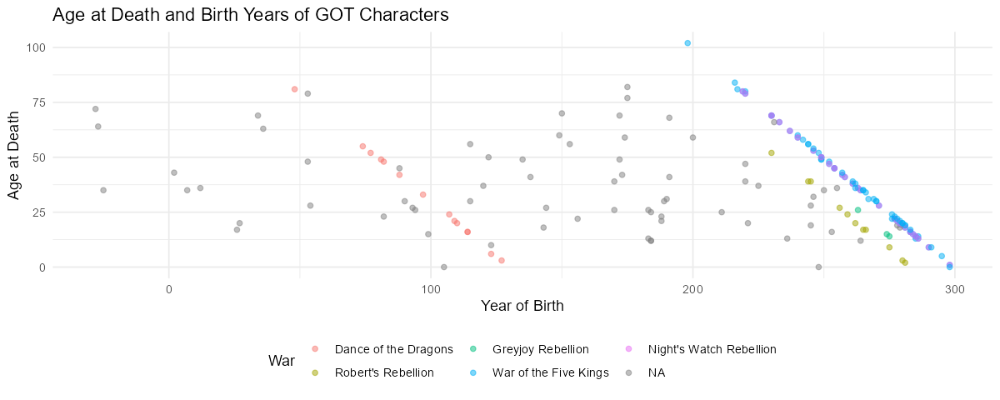
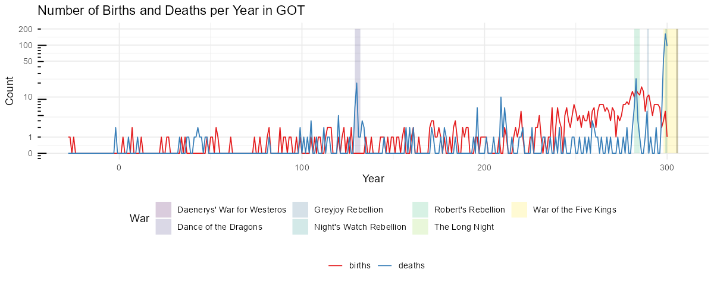
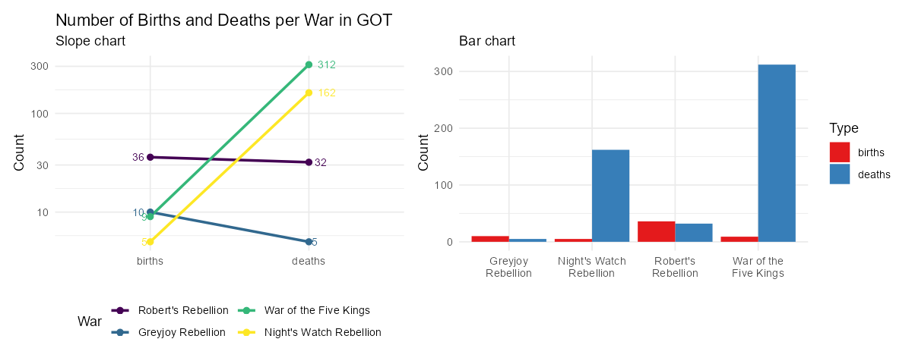

# Myndræn framsetning

Myndræn framsetning gagna er áhrifarík leið til að draga fram lykilatriði í gögnum og auðvelda
lesendum að skilja flókin sambönd. Grafískir miðlar eins og línurit, súlurit og dreifirit veita oft
skýra mynd af þróun, mynstrum og tengslum. Hins vegar þarf að vanda vel til verka þegar ákvörðun er
tekin um að nota graf til að sýna upplýsingar, því í sumum tilvikum getur einföld framsetning með
texta verið betri lausn.

## Undantekning: Fáar tölur

Ef þið eruð með eina eða tvær tölur til að sýna, sleppið því að nota graf. Þegar aðeins er verið að
miðla einni eða tveimur tölum er sjaldan þörf á grafískri framsetningu. Yfirleitt gera gröf ekki
gagn í þessu tilfelli og geta jafnvel verið villandi. Graf fyrir svo fáar tölur getur virst óþarfa
flókið og gefið til kynna meiri upplýsingar eða dýpt en raunverulega er til staðar.

Notið frekar tölurnar sjálfar ásamt nokkrum orðum. Einföld og skýr textafræðileg framsetning er oft
nægileg og dregur betur fram upplýsingar en flókið graf. Með því að sýna tölurnar beint í texta er
minni hætta á misskilningi og það er auðveldara fyrir lesandann að átta sig á gildi þeirra.

Til dæmis má líta á mynd eins og þessa sem sýnir fjölda sögupersóna fyrstu tveimur GOT
bókunum, *Game of Thrones* og *Clash of Kings*:

Ef tilgangurinn væri aðeins að miðla einni eða tveimur tölum, þá væri nóg að segja einfaldlega: „9
sögupersónur í *Game of Thrones* og 10 í *Clash of Kings*.“ frekar en að setja upp graf eða töflu.

Það er mikilvægt að gæta þess að framsetningin sé ekki villandi. Sérstaklega þarf að varast það
að sameina tvær tölur í eina, þar sem mikilvægar upplýsingar geta auðveldlega tapast fyrir lesanda.
Það getur leitt til rangrar túlkunar eða gert lesendum erfiðara fyrir að skilja gögnin á réttan
hátt.

Hér til dæmis væri erfitt að túlka hvort 10% aukning af sögupersónum í *Clash of Kings* sé
eðlileg eða óeðlileg, þar sem það er ekki ljóst hvort aukningin sé frá 9 til 10 eða 90 til 100.

> **Athugasemd**: Með því að íhuga hvort graf sé raunverulega nauðsynlegt getið þið sparað tíma og
> komið skilaboðum á framfæri með meiri nákvæmni.

## Gagnatafla - Data Table

Töflur eru algeng leið til að sýna gögn og geta verið mjög áhrifaríkar í réttu samhengi. Hins vegar
er mikilvægt að vita hvenær best er að nota töflur og hvernig þær eru hannaðar á áhrifaríkan hátt.

Nánar um [Data Table](https://www.storytellingwithdata.com/blog/2020/9/24/what-is-a-table) á
*Storytelling with data.*

### Hvenær á að nota töflu?

- **Blandaður áhorfendahópur**: Töflur henta vel þegar við erum með fjölbreyttan áhorfendahóp, þar
  sem hver og einn getur leitað upp upplýsingar sem eru mikilvægar fyrir hann.
- **Mismunandi einingar**: Ef gögnin samanstanda af mörgum mismunandi mælieiningum, eins og í
  samantektum eða lýðfræðilegum upplýsingum, getur tafla verið betri en graf.
- **Áhorfendur þurfa að lesa línu fyrir línu**: Töflur eru sérstaklega gagnlegar í fjármálum og
  bókhaldi, þar sem notendur eru vanir að lesa og greina línur.
- **Aðgengi að öllum gögnum**: Ef þú vilt gefa áhorfendum möguleika á að skoða öll gögnin í
  smáatriðum, er tafla oft góður kostur.

### Hvenær á að sleppa töflum?

- **Í kynningum**: Þú gætir tapað athygli áhorfenda ef þeir eru að lesa töflu á meðan þú talar. Þá
  er betra að nota graf eða aðra myndræna framsetningu.
- **Þegar þú vilt sýna mynstur**: Ef markmiðið er að draga fram mynstur eða þróun í gögnum, eru gröf
  oft betri þar sem þau auðvelda skilning á heildarmyndinni.

### Hönnun góðrar töflu

Til að hanna fallega og nothæfa töflu er mikilvægt að einfalda hana og gera hana auðlesna:

- **Notaðu ljósar línur**: Þykkar svartar línur geta dregið óþarflega mikla athygli frá gögnunum.
  Ljósgráar línur eru betri valkostur.
- **Fjarlægðu óþarfa skugga og umgjörð**: Of miklar útlínur eða skyggingar geta gert töfluna
  óþarflega þunga.
- **Bættu við sjónrænum þáttum**: Það getur verið gagnlegt að bæta við sjónrænum þáttum eins og
  litaðri bakgrunnsmerkingu eða línum til að undirstrika mikilvægar upplýsingar.

### Verkfæri til töflugerðar

Til að búa til fallegar töflur í _R_, getur þú notað pakkana `kableExtra` eða `gt`. Í _LaTeX_
getur þú nýtt þér pakkana `booktabs` og `tabu` til að gera töflur sem eru vel uppsettar og
fagurfræðilega heillandi.

#### Hitakort (Heatmap)

- **Góð leið til framsetningar**: Hitakort eru áhrifarík leið til að bæta sjónrænum vísbendingum
  inn í töflur, þar sem þau geta hjálpað áhorfendum að draga saman aðalatriðin.
- **Beinir athygli**: Með því að nota mismunandi litablæbrigði er hægt að beina athygli áhorfenda að
  mikilvægustu gögnunum.
- **Tölur í boxum**: Einnig er hægt að setja tölur inn í reitina á hitakortinu, en það getur stundum
  orðið of mikið af upplýsingum og gert framsetninguna of þétta.

## Dreifirit - Scatter Plot

Dreifirit (scatter plot) er öflug leið til að sýna samband milli tveggja tölulegra breyta. Þetta
graf er mikið notað í vísindasamfélaginu og atvinnulífinu til að skoða hvort tengsl séu milli
tveggja breyta og hvort ákveðin mynstur eða útlagagildi komi í ljós.

Dreifirit nýtast vel til að greina gögn á rannsóknarstigi, en þau geta líka verið gagnleg við miðlun
upplýsinga þegar þau eru rétt hönnuð. Til dæmis er oft notað litakóða eða bæta við meðaltalslínum
til að gera mynstrin enn skýrari og aðgreina þau gildi sem skera sig úr frá meðaltalinu.

### Kostir dreifirita:

- **Sýna samband tveggja breyta**: Hvert gagnapunktur í dreifiriti táknar sambandið milli tveggja
  tölulegra breyta. Þetta gerir það auðvelt að sjá hvort og hvernig breyturnar tengjast.
- **Notað í greiningu á útlögum**: Útlög eru gildi sem eru langt frá öðrum gögnum og dreifirit gera
  það auðvelt að greina slík gildi.
- **Meðaltalslínur og litir**: Meðaltalslínur og litir eru oft notaðir til að sýna hvaða gildi eru
  óvenjuleg eða langt frá meðaltalinu.

### Hönnunarráð:

- **Fjarlægja óþarfa sjónræna þætti**: Þegar dreifirit er notað í kynningu er oft best að fjarlægja
  trendlínur og óþarfa línur sem gætu flækt myndina.
- **Glærari punktar**: Ef mörg gildi skarast í grafi, er hægt að minnka ógagnsæi punktanna svo að
  sjáist betur hvert gildi.

Nánar um [Scatterplot](http://www.storytellingwithdata.com/blog/2020/5/27/what-is-a-scatterplot) á
*Storytelling with data.*

## Línurit - Line Graph

Línurit eru öflug leið til að sýna breytingar á samfelldum gögnum yfir tíma, eins og daga, mánuði
eða ár. Þau eru oft notuð til að sýna tímaraðir, eins og fjölda ferðamanna á tilteknu tímabili, og
þau bjóða upp á sveigjanleika í framsetningu þar sem hægt er að sýna fleiri en eina tímaröð á sama
grafi.

### Kostir línurita

- **Sýnir breytingar yfir tíma**: Línurit er best notað þegar þú vilt sýna hvernig gildi breytist
  yfir tíma eða bera saman hvernig fleiri en ein breyta þróast yfir sama tímabil.
- **Einfallt og skiljanlegt**: Línurit eru einföld og auðskilin þar sem þau hjálpa að sýna
  breytingar og þróun á einfaldan hátt.
- **Fleiri tímarásir**: Hægt er að teikna fleiri en eina tímaröð á sama línuriti, en passið að nota
  liti skynsamlega til að greina á milli þeirra.

### Hvenær á ekki að nota línurit?

- **Ekki notað fyrir flokkabreytur**: Línurit eiga ekki við þegar um er að ræða flokkabreytur, þar
  sem línur tengja saman ólík atriði sem ekki eiga að vera tengd.
- **Villandi notkun á bili**: Ef bilin á milli mælinga eru ekki samfelld (t.d. 10 ár milli tveggja
  punkta og síðan aðeins 1 ár milli næstu) getur það orðið villandi.

### Hönnun góðs línurits

- **Meðaltalslínur og skýringar**: Línuritum er oft bætt við meðaltalslínum eða öðrum sjónrænum
  vísbendingum til að veita betri samhengi, en gæta þarf að það sé ekki of mikið sjónrænt álag.
- **Tímaraðir með mörgum línum**: Ef þú ert að sýna fleiri en 4-5 línur á línuriti, vertu viss um að
  notast við skýrar litaval og merkja helstu línur. Því fleiri línur, því meira flækjustig og því
  meiri hætta á að áhorfendur missi yfirsýn.
- **Y-ás byrjar ekki alltaf á núlli**: Það er ekki alltaf nauðsynlegt að y-ás byrji á núlli,
  sérstaklega þegar breytingar eru smávægilegar og þarf að sýna mun betur. Hins vegar þarf
  áhorfendur að vera meðvitaðir um slíkt til að forðast misskilning.

### Dæmi um notkun línurits

Línurit er tilvalið til að sýna breytingar á sölutölum á sex mánaða tímabili. Það hjálpar þér að
greina hæstu og lægstu sölu og bjóða upp á samanburð með framsýnum gögnum, sem getur skipt miklu
máli þegar ákvörðun er tekin um næstu skref í rekstri.

Nánar um [Line Graph](https://www.storytellingwithdata.com/blog/2020/3/24/what-is-a-line-graph) á
*Storytelling with data.*

## Hallarit - Slope Graph

Hallarit er svipað og línurit, en með þeim mun að hver lína hefur aðeins tvo gagnapunkta. Þetta
þýðir að það er hægt að bera saman tvö gildi, til dæmis frá upphafs- og endapunkti tímabils eða á
milli tveggja flokka. Markmið hallarits er að sýna hvort gildi hafi hækkað, lækkað, eða haldist
óbreytt milli þessara tveggja punkta.

### Kostir

- **Sýnir breytingar skýrt**: Hallarit gerir breytingar milli tveggja punkta greinilegri. Hallinn á
  línunni sýnir hvort gildi hafi aukist eða minnkað, og því brattari sem hallinn er, því meiri er
  breytingin.
- **Einblínir á samanburð**: Með því að einungis bera saman tvo punkta er auðveldara að sjá hver
  breytist mest á milli þeirra.
- **Einfallt að túlka**: Fyrir flóknari gagnasöfn sem innihalda mörg flökt yfir tíma er hallarit
  góð leið til að draga saman þróun án þess að tímabilin á milli þurfi að vera sýnileg.

### Gallar

- **Takmarkað fyrir tímaröð**: Ef þörf er á að skoða þróun yfir lengra tímabil með mörgum
  tímapunktum er línurit betra.
- **Gefur ekki nákvæmar tölur**: Hallarit sýnir breytingar en ekki nákvæmar tölur. Fyrir slík
  tilvik er súlurit betra.

### Dæmi um notkun hallarits

Hér má sjá muninn á því að nota hallarit og súlurit annars vegar til að sýna muninn á fjölda 
fæðinga og dauðsfalla í mismunandi stríðstímabilum í *Game of Thrones*. Hallarit sýnir breytingar á
skýran hátt, en súlurit getur verið of flókið og óskýrt.

Nánar um [Slope Graph](http://www.storytellingwithdata.com/blog/2020/7/27/what-is-a-slopegraph) á
*Storytelling with data.*

## Flatarmyndrit - Area Graph

Nánar um [Area Graph](https://www.storytellingwithdata.com/blog/2020/4/9/what-is-an-area-graph) á
*Storytelling with data.*

## Stöplarit - Bar Chart

Nánar um [Bar Chart](https://www.storytellingwithdata.com/blog/2020/2/19/what-is-a-bar-chart)
og [Stacked Bar Chart](https://www.storytellingwithdata.com/blog/stacked-bars) á *Storytelling with
data.*

### Stuðlarit - Histogram

Nánar um muninn
á [Histogram og Bar Chart](https://www.storytellingwithdata.com/blog/2021/1/28/histograms-and-bar-charts)
á *Storytelling with data.*

## Kassarit - Box Plot

Nánar um [Box Plot](https://www.storytellingwithdata.com/blog/what-is-a-boxplot) á *Storytelling
with data.*

## Kúlurit - Bubble Chart

Nánar um [Bubble Chart](https://www.storytellingwithdata.com/blog/2021/5/11/what-is-a-bubble-chart)
á *Storytelling with data.*

## Skotmarkarit - Bullet Graph

Nánar um [Bullet Graph](https://www.storytellingwithdata.com/blog/what-is-a-bullet-graph) á
*Storytelling with data.*

## Punktarit - Dot Plot

Nánar um [Dot Plot](http://www.storytellingwithdata.com/blog/2020/12/9/what-is-a-dot-plot) á
*Storytelling with data.*

## Flæðirit - Flowchart

Nánar um [Flowchart](https://www.storytellingwithdata.com/blog/what-is-a-flowchart) á *Storytelling
with data.*

## Kökurit - Pie Chart

Nánar um [Pie Chart](http://www.storytellingwithdata.com/blog/2020/5/14/what-is-a-pie-chart) á
*Storytelling with data.*

## Sankey-rit - Sankey Diagram

Nánar um [Sankey Diagram](https://www.storytellingwithdata.com/blog/what-is-a-sankey-diagram) á
*Storytelling with data.*

## Köngulórit - Spider Chart

Nánar um [Spider Chart](https://www.storytellingwithdata.com/blog/2021/8/31/what-is-a-spider-chart)
á *Storytelling with data.*

## Flatarmálsrit - Square Area Chart

Nánar um [Square Area Chart](https://www.storytellingwithdata.com/blog/what-is-a-square-area-chart)
á *Storytelling with data.*

## Trémynd - Treemap

Nánar um [Treemap](https://www.storytellingwithdata.com/blog/what-is-a-treemap) á *Storytelling with
data.*

## Fossarit - Waterfall Chart

Nánar um [Waterfall Chart](http://www.storytellingwithdata.com/blog/2020/11/16/what-is-a-waterfall)
á *Storytelling with data.*

## Einingarit - Unit Chart

Nánar um [Unit Chart](https://www.storytellingwithdata.com/blog/what-is-a-unit-chart) á
*Storytelling with data.