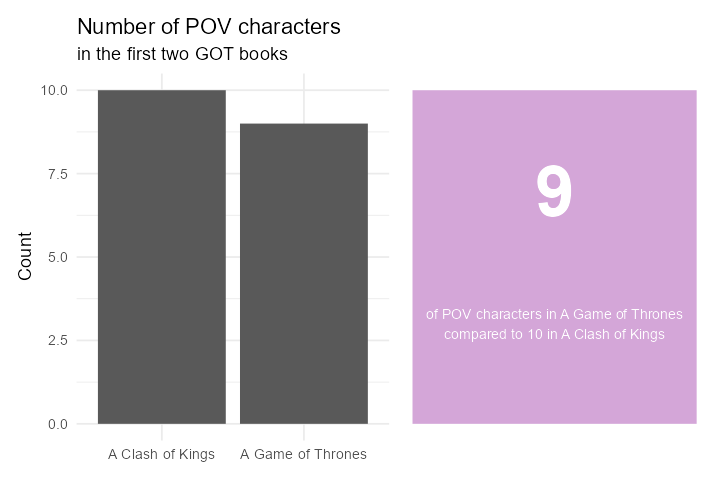
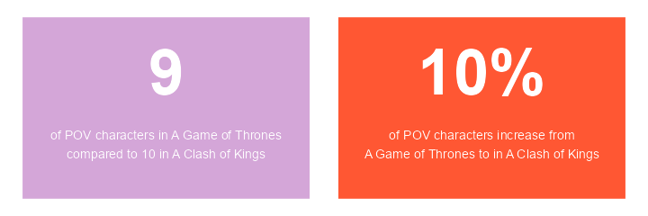
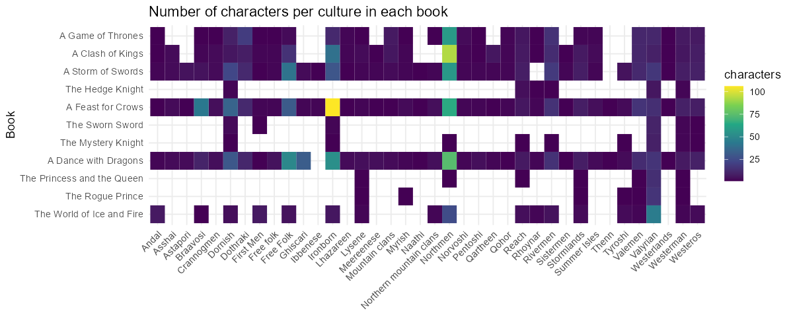
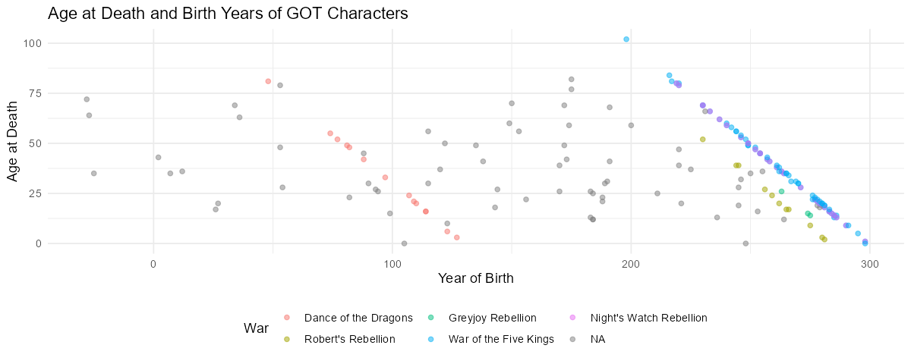
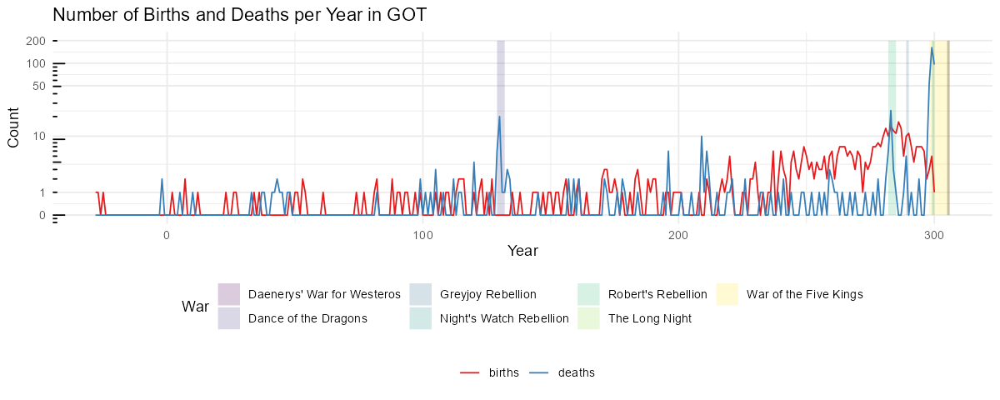
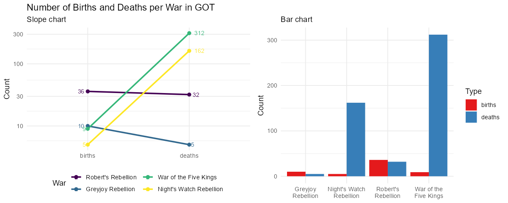

# Myndræn framsetning

Myndræn framsetning gagna er áhrifarík leið til að draga fram lykilatriði í gögnum og auðvelda
lesendum að skilja flókin sambönd. Grafískir miðlar eins og línurit, súlurit og dreifirit veita oft
skýra mynd af þróun, mynstrum og tengslum. Hins vegar þarf að vanda vel til verka þegar ákvörðun er
tekin um að nota graf til að sýna upplýsingar, því í sumum tilvikum getur einföld framsetning með
texta verið betri lausn.

## Undantekning: Fáar tölur

Ef þið eruð með eina eða tvær tölur til að sýna, sleppið því að nota graf. Þegar aðeins er verið að
miðla einni eða tveimur tölum er sjaldan þörf á grafískri framsetningu. Yfirleitt gera gröf ekki
gagn í þessu tilfelli og geta jafnvel verið villandi. Graf fyrir svo fáar tölur getur virst óþarfa
flókið og gefið til kynna meiri upplýsingar eða dýpt en raunverulega er til staðar.

Notið frekar tölurnar sjálfar ásamt nokkrum orðum. Einföld og skýr textafræðileg framsetning er oft
nægileg og dregur betur fram upplýsingar en flókið graf. Með því að sýna tölurnar beint í texta er
minni hætta á misskilningi og það er auðveldara fyrir lesandann að átta sig á gildi þeirra.

Til dæmis má líta á mynd eins og þessa sem sýnir fjölda sögupersóna fyrstu tveimur GOT
bókunum, *Game of Thrones* og *Clash of Kings*:

Ef tilgangurinn væri aðeins að miðla einni eða tveimur tölum, þá væri nóg að segja einfaldlega: „9
sögupersónur í *Game of Thrones* og 10 í *Clash of Kings*.“ frekar en að setja upp graf eða töflu.

Það er mikilvægt að gæta þess að framsetningin sé ekki villandi. Sérstaklega þarf að varast það
að sameina tvær tölur í eina, þar sem mikilvægar upplýsingar geta auðveldlega tapast fyrir lesanda.
Það getur leitt til rangrar túlkunar eða gert lesendum erfiðara fyrir að skilja gögnin á réttan
hátt.

Hér til dæmis væri erfitt að túlka hvort 10% aukning af sögupersónum í *Clash of Kings* sé
eðlileg eða óeðlileg, þar sem það er ekki ljóst hvort aukningin sé frá 9 til 10 eða 90 til 100.

> **Athugasemd**: Með því að íhuga hvort graf sé raunverulega nauðsynlegt getið þið sparað tíma og
> komið skilaboðum á framfæri með meiri nákvæmni.

## Gagnatafla - Data Table

Töflur eru algeng leið til að sýna gögn og geta verið mjög áhrifaríkar í réttu samhengi. Hins vegar
er mikilvægt að vita hvenær best er að nota töflur og hvernig þær eru hannaðar á áhrifaríkan hátt.

Nánar um [Data Table](https://www.storytellingwithdata.com/blog/2020/9/24/what-is-a-table) á
*Storytelling with data.*

### Hvenær á að nota töflu?

- **Blandaður áhorfendahópur**: Töflur henta vel þegar við erum með fjölbreyttan áhorfendahóp, þar
  sem hver og einn getur leitað upp upplýsingar sem eru mikilvægar fyrir hann.
- **Mismunandi einingar**: Ef gögnin samanstanda af mörgum mismunandi mælieiningum, eins og í
  samantektum eða lýðfræðilegum upplýsingum, getur tafla verið betri en graf.
- **Áhorfendur þurfa að lesa línu fyrir línu**: Töflur eru sérstaklega gagnlegar í fjármálum og
  bókhaldi, þar sem notendur eru vanir að lesa og greina línur.
- **Aðgengi að öllum gögnum**: Ef þú vilt gefa áhorfendum möguleika á að skoða öll gögnin í
  smáatriðum, er tafla oft góður kostur.

### Hvenær á að sleppa töflum?

- **Í kynningum**: Þú gætir tapað athygli áhorfenda ef þeir eru að lesa töflu á meðan þú talar. Þá
  er betra að nota graf eða aðra myndræna framsetningu.
- **Þegar þú vilt sýna mynstur**: Ef markmiðið er að draga fram mynstur eða þróun í gögnum, eru gröf
  oft betri þar sem þau auðvelda skilning á heildarmyndinni.

### Hönnun góðrar töflu

Til að hanna fallega og nothæfa töflu er mikilvægt að einfalda hana og gera hana auðlesna:

- **Notaðu ljósar línur**: Þykkar svartar línur geta dregið óþarflega mikla athygli frá gögnunum.
  Ljósgráar þunnar línur eru betri valkostur.
- **Fjarlægðu óþarfa skugga og umgjörð**: Of miklar útlínur eða skyggingar geta gert töfluna
  óþarflega þunga.
- **Bættu við sjónrænum þáttum**: Það getur verið gagnlegt að bæta við sjónrænum þáttum eins og
  litaðri bakgrunnsmerkingu eða línum til að undirstrika mikilvægar upplýsingar.

### Verkfæri til töflugerðar

Til að búa til fallegar töflur í _R_, getur þú notað pakkana `kableExtra` eða `gt`. Í _LaTeX_
getur þú nýtt þér pakkana `booktabs` og `tabu` til að gera töflur sem eru vel uppsettar og
fagurfræðilega heillandi.

### Hitakort - Heatmap

- **Góð leið til framsetningar**: Hitakort eru áhrifarík leið til að bæta sjónrænum vísbendingum
  inn í töflur, þar sem þau geta hjálpað áhorfendum að draga saman aðalatriðin.
- **Beinir athygli**: Með því að nota mismunandi litablæbrigði er hægt að beina athygli áhorfenda að
  mikilvægustu gögnunum.
- **Tölur í boxum**: Einnig er hægt að setja tölur inn í reitina á hitakortinu, en það getur stundum
  orðið of mikið af upplýsingum og gert framsetninguna of þétta.

Þetta hitakort sýnir fjölda sögupersóna eftir menningu (culture) í hverri bók í _Game of Thrones_
seríunni. Á lóðrétta ásnum eru bækurnar í réttri röð, frá fyrstu til síðustu, og á lárétta ásnum eru
mismunandi menningarhópar. Flísarnar (`geom_tile`) tákna fjölda sögupersóna fyrir hvern menningarhóp
í hverri bók. Liturinn á flísunum endurspeglar fjöldann, þar sem dekkri litir tákna fleiri persónur.

## Dreifirit - Scatter Plot

Dreifirit (scatter plot) er öflug leið til að sýna samband milli tveggja tölulegra breyta. Þetta
graf er mikið notað í vísindasamfélaginu og atvinnulífinu til að skoða hvort tengsl séu milli
tveggja breyta og hvort ákveðin mynstur eða útlagagildi komi í ljós.

Dreifirit nýtast vel til að greina gögn á rannsóknarstigi, en þau geta líka verið gagnleg við miðlun
upplýsinga þegar þau eru rétt hönnuð. Til dæmis er oft notað litakóða eða bæta við meðaltalslínum
til að gera mynstrin enn skýrari og aðgreina þau gildi sem skera sig úr frá meðaltalinu.

### Kostir dreifirits

- **Sýna samband tveggja breyta**: Hver gagnapunktur í dreifiriti táknar sambandið milli tveggja
  tölulegra breyta. Þetta gerir það auðvelt að sjá hvort og hvernig breyturnar tengjast.
- **Notað í greiningu á útlögum**: Útlagar (outliers) eru gildi sem eru langt frá öðrum
  gögnum og dreifirit gera það auðvelt að greina slík gildi.
- **Meðaltalslínur og litir**: Meðaltalslínur og litir eru oft notaðir til að sýna hvaða gildi eru
  óvenjuleg eða langt frá meðaltalinu.

#### Hönnunarráð

- **Fjarlægja óþarfa sjónræna þætti**: Þegar dreifirit er notað í kynningu er oft best að fjarlægja
  trendlínur og óþarfa línur sem gætu flækt myndina.
- **Glærari punktar**: Ef mörg gildi skarast í grafi, er hægt að minnka ógagnsæi (`alias`) punktanna
  svo að sjáist betur hvert gildi.

Þetta dreifirit sýnir aldur við andlát sögupersóna í _Game of Thrones_ og hvaða ár þær fæddust.
Hver punktur táknar eina sögupersónu, þar sem lárétti ásinn sýnir fæðingarár hennar og lóðrétti
ásinn aldur við andlát. Litur punktanna vísar til þess hvaða stríð sögupersónan lést í, sem
auðveldar samanburð á milli þeirra.

Nánar um [Scatterplot](http://www.storytellingwithdata.com/blog/2020/5/27/what-is-a-scatterplot) á
*Storytelling with data.*

## Línurit - Line Graph

Línurit eru öflug leið til að sýna breytingar á samfelldum gögnum yfir tíma, eins og daga, mánuði
eða ár. Þau eru oft notuð til að sýna tímaraðir, eins og fjölda ferðamanna á tilteknu tímabili, og
þau bjóða upp á sveigjanleika í framsetningu þar sem hægt er að sýna fleiri en eina tímaröð á sama
grafi.

#### Kostir línurita

- **Sýnir breytingar yfir tíma**: Línurit er best notað þegar þú vilt sýna hvernig gildi breytist
  yfir tíma eða bera saman hvernig fleiri en ein breyta þróast yfir sama tímabil.
- **Einfalt og skiljanlegt**: Línurit eru einföld og auðskilin þar sem þau hjálpa að sýna
  breytingar og þróun á einfaldan hátt.
- **Fleiri tímarásir**: Hægt er að teikna fleiri en eina tímaröð á sama línuriti, en passið að nota
  liti skynsamlega til að greina á milli þeirra.

#### Hvenær á ekki að nota línurit?

- **Ekki notað fyrir flokkabreytur**: Línurit eiga ekki við þegar um er að ræða flokkabreytur, þar
  sem línur tengja saman ólík atriði sem ekki eiga að vera tengd.
- **Villandi notkun á bili**: Ef bilin á milli mælinga eru ekki samfelld (t.d. 10 ár milli tveggja
  punkta og síðan aðeins 1 ár milli næstu) getur það orðið villandi.

#### Hönnun góðs línurits

- **Meðaltalslínur og skýringar**: Línuritum er oft bætt við meðaltalslínum eða öðrum sjónrænum
  vísbendingum til að veita betri samhengi, en gæta þarf að það sé ekki of mikið sjónrænt álag.
- **Tímaraðir með mörgum línum**: Ef þú ert að sýna fleiri en 4-5 línur á línuriti, vertu viss um að
  notast við skýrt litaval og merkja helstu línur. Því fleiri línur, því meira flækjustig og því
  meiri hætta á að áhorfendur missi yfirsýn.
- **Y-ás byrjar ekki alltaf á núlli**: Það er ekki alltaf nauðsynlegt að y-ás byrji á núlli,
  sérstaklega þegar breytingar eru smávægilegar og þarf að sýna mun betur. Hins vegar þarf
  áhorfendur að vera meðvitaðir um slíkt til að forðast misskilning.
- **Skala ása meðvitað**: Breytingar á skölun á x- eða y-ásum geta haft mikilvæg áhrif á túlkun
  gagna í myndrænum framsetningum. Til dæmis er logaritmísk skölun (t.d. með `scale_x_log10()`)
  sérstaklega gagnleg þegar unnið er með gögn sem hafa vítt svið, þar sem hún getur hjálpað til við
  að draga úr áhrifum stórra afbrigða. Öfugt við það getur breytileg stærð eins og ferningsrót (t.d.
  með `scale_y_sqrt()`) gert gögn skiljanlegri ef dreifingin er ójöfn. Að snúa ásum
  (með `scale_y_reverse()`) getur einnig verið gagnlegt í ákveðnum aðstæðum þar sem röð gagna er
  mikilvæg (þetta á frekar við um flokkabreytur en samfelldar). Það er mikilvægt að velja rétta
  skölun eftir eðli gagna og tilgangi framsetningar til að forðast að rugla lesandann.

Þetta línurit sýnir fjölda fæðinga og dauðsfalla eftir árum í _Game of Thrones_ heiminum. Lárétti
ásinn sýnir árin sem fæðingar og dauðsföll eiga sér stað, og lóðrétti ásinn sýnir fjöldann. Tvær
línur eru á grafinu; önnur fyrir fæðingar og hin fyrir dauðsföll. Litir á strikum tákna hvort gögnin
snúist um fæðingar eða dauðsföll. Að auki eru stríðstímabil merkt með skuggum á bakgrunninum, þar
sem hvert stríð hefur sinn lit.

Línuritið notar log-10 umbreytingu til að draga úr áhrifum stórra talna og sýna breytingar á
fjölda á meiri skalanum. Þetta gefur betri yfirsýn yfir þróun á fjölda fæðinga og dauðsfalla á
mismunandi árum, án þess að missa af smærri sveiflum í fjölda.

Nánar um [Line Graph](https://www.storytellingwithdata.com/blog/2020/3/24/what-is-a-line-graph) á
*Storytelling with data.*

## Hallarit - Slope Graph

Hallarit er svipað og línurit, en með þeim mun að hver lína hefur aðeins tvo gagnapunkta. Þetta
þýðir að það er hægt að bera saman tvö gildi, til dæmis frá upphafs- og endapunkti tímabils eða á
milli tveggja flokka. Markmið hallarits er að sýna hvort gildi hafi hækkað, lækkað, eða haldist
óbreytt milli þessara tveggja punkta.

#### Kostir

- **Sýnir breytingar skýrt**: Hallarit gerir breytingar milli tveggja punkta greinilegri. Hallinn á
  línunni sýnir hvort gildi hafi aukist eða minnkað, og því brattari sem hallinn er, því meiri er
  breytingin.
- **Einblínir á samanburð**: Með því að einungis bera saman tvo punkta er auðveldara að sjá hver
  breytist mest á milli þeirra.
- **Einfalt að túlka**: Fyrir flóknari gagnasöfn sem innihalda mörg flökt yfir tíma er hallarit
  góð leið til að draga saman þróun án þess að tímabilin á milli þurfi að vera sýnileg.

#### Gallar

- **Takmarkað fyrir tímaröð**: Ef þörf er á að skoða þróun yfir lengra tímabil með mörgum
  tímapunktum er línurit betra.
- **Gefur ekki nákvæmar tölur**: Hallarit sýnir breytingar en ekki nákvæmar tölur. Fyrir slík
  tilvik er súlurit betra.

#### Dæmi um notkun hallarits

Hér má sjá muninn á því að nota hallarit og súlurit annars vegar til að sýna muninn á fjölda
fæðinga og dauðsfalla í mismunandi stríðstímabilum í *Game of Thrones*. Hallarit sýnir breytingar á
skýran hátt, en súlurit getur verið of flókið og óskýrt.

- **Hallaritið**: tengir saman fæðingar og dauðsföll fyrir hvert stríð með línum sem sýna hvort
  dauðsföll eða fæðingar séu fleiri. Hallinn á línunum táknar breytingar eða mismun milli
  þessara tveggja flokka, sem gerir það einfalt að sjá þróunina í hverju stríði. Þetta graf er
  sérstaklega gagnlegt til að sýna hlutfallslegan samanburð milli fæðinga og dauðsfalla frekar en
  nákvæmar tölur.

- **Súluritið** sýnir fjölda fæðinga og dauðsfalla fyrir hvert stríð í Game of Thrones með því
  að setja súlur hlið við hlið fyrir hvern flokk. Þetta gerir það auðvelt að bera saman nákvæman
  fjölda fæðinga og dauðsfalla í hverju stríði. Með skýrum súlum og litum sem tákna flokkana,
  veitir súluritið góða yfirsýn yfir stærðarmuninn á milli flokkanna.

Helsti munurinn á súluriti og hallariti er að súluritið gefur nákvæma mynd af fjölda fæðinga og
dauðsfalla, sem er sérstaklega gagnlegt ef áherslan er á nákvæmar tölur fyrir hvert stríð, á meðan
hallaritið einblínir á breytingar og samanburð milli fæðinga og dauðsfalla, sem hentar betur ef
áherslan er á þróunina frekar en nákvæmar tölur. Þessi samanburður sýnir hvernig mismunandi grafgerð
getur haft áhrif á miðlun upplýsinga, þar sem súluritið leggur áherslu á nákvæma samanburð á
stærðum, en hallaritið leggur áherslu á breytingar milli tveggja punkta.

Nánar um [Slope Graph](http://www.storytellingwithdata.com/blog/2020/7/27/what-is-a-slopegraph) á
*Storytelling with data.*

## Stöplarit - Bar Chart

Stöplarit eru algeng myndræn framsetning til að setja fram flokkagögn eða gögn flokkuð í hópa. Í
stöplariti er lengd hvers stöpuls í réttu hlutfalli við gildið sem hann táknar – því lengri sem
stöpullinn er, því hærra er gildið. Þetta gerir stöplarit mjög skiljanleg þar sem augu okkar eru góð
í að bera saman lengdir á hlutum sem eru í sama grunnlínu. Þar með er auðvelt að bera saman stærðir
milli hópa með því að skoða hæðina á stöpulunum.

> Stöplarit byrjar _alltaf_ á núlli á lóðréttum ásnum til að tryggja réttan samanburð. Það er þó í
> lagi að breyta sköluninni á lóðréttum ásnum ef það er nauðsynlegt til að sjá breytingar skýrar.

### Venjulegt stöplarit

Venjulegt stöplarit er súlurit þar sem hver stöpull stendur fyrir eina breytu. Lárétti ásinn sýnir
flokka eða hópa, og lóðrétti ásinn sýnir gildi hvers flokks. Þetta graf er algengasta tegund
stöplarita og er oft notað til að sýna einfaldan samanburð á milli mismunandi flokka eða hópa.

Þegar verið er að hanna stöplarit er mikilvægt að fylgjast með eftirfarandi:

- Bilið milli stöpla ætti að vera þynnra en breidd stöplanna, yfirleitt á bilinu 30%-40%.
- Passið að raða stöplunum á réttan hátt, sérstaklega ef gögnin hafa eðlilega röð, eins og aldursbil
  eða tíðniröð.
- Grunnlínan á lóðrétta ásnum (y-ásinn) ætti alltaf að byrja á núlli til að forðast villandi
  framsetningu.

Nánar um [Bar Chart](https://www.storytellingwithdata.com/blog/2020/2/19/what-is-a-bar-chart)
á *Storytelling with data.*

### Stöplarit með stöflum

Í stöplariti með stöflum  (Stacked Bar Chart) eru tvær eða fleiri flokkabreytur sýndar í sama
stöpli. Fyrri breytan er sýnd með heildarhæð stöplanna, og önnur breyta er sýnd með undirhlutum
innan hvers stöpuls. Stöfluritin geta verið gagnleg til að sjá heildarmagn og hvernig undirhlutarnir
leggja til þessa heildar. Hins vegar er oft erfitt að bera saman undirhluta stöplanna þar sem þeir
hafa ekki samræmdar grunnlínur.

Notkun stöflurita getur verið gagnleg þegar bæði heildin og undirhlutarnir skipta máli, en ef
áherslan er á undirhlutana er betra að nota önnur graf.

Nánar um [Stacked Bar Chart](https://www.storytellingwithdata.com/blog/stacked-bars) á
*Storytelling with data.*

## Stuðlarit - Histogram

Stuðlarit er ekki sama grafgerð og venjuleg stöplarit. Í stuðlariti eru stöplarnir notaðir til að
sýna dreifingu magnbundinna gagna, oft _samfelldra_ gagna. Stöplarnir eru ekki fyrir
flokkabreytur heldur eru þeir notaðir til að sýna tíðni gilda innan ákveðinna bili. Stöplarnir í
stuðlariti snerta hvern annan, sem undirstrikar að gögnin eru samfelld.

Stuðlarit henta sérstaklega vel þegar markmiðið er að sýna lögun eða dreifingu talnagagna, eins og
fjölda seldra fasteigna á tilteknu verði, eða dreifingu nemenda eftir einkunnum. Þegar stuðlarit eru
hönnuð er mikilvægt að halda röð stöplanna réttri, þar sem gögnin eru samfelld frá minnstu til
stærstu gildanna.

Nánar um muninn
á [Histogram og Bar Chart](https://www.storytellingwithdata.com/blog/2021/1/28/histograms-and-bar-charts)
á *Storytelling with data.*

## Fossarit - Waterfall Chart

Fossarit (waterfall chart) er sérstök tegund af stöplariti sem sýnir hvernig nettóbreytingar í
einhverju gildi koma til á milli tveggja punkta. Í stað þess að sýna bara upphafsgildi í einum
stöpli og lokagildi í öðrum, brýtur fossarit niður einstaka þætti sem stuðla að breytingunni og
sýnir þá hvern fyrir sig. Þannig gefur fossarit betri yfirsýn yfir samsetningu breytingarinnar.

Fossarit fær nafn sitt af löguninni sinni. Fyrsti stöpullinn byrjar oftast við núll og táknar
upphafsgildi. Síðan eru fleiri stöplar, sem virðast „fljóta“ í rýminu, sem leiða að lokastöplinum,
sem sýnir lokagildi og byrjar einnig við núll. Þessi rit geta sýnt flókna mynd af breytingum sem
geta verið falin í uppsafnaðri tölu, og eru algeng í fjármálaiðnaði og mannauðsstjórnun, þar sem þau
eru notuð til að sýna t.d. heildarjöfnuð eða breytingar á fjölda starfsmanna.

Nánar um [Waterfall Chart](http://www.storytellingwithdata.com/blog/2020/11/16/what-is-a-waterfall)
á *Storytelling with data.*

#### Hvernig virkar fossarit?

Í fossariti eru aðeins fyrsti og síðasti stöpullinn bundnir við sameiginlega grunnlínu (venjulega
núll). Miðstöplarnir eru settir á mismunandi grunnlínur byggt á hlaupandi samtölu og mynda þannig
eins konar stigastefnu milli byrjunar- og lokapunkta. Þetta getur verið krefjandi fyrir áhorfendur
að túlka, en litir og tengingar á milli stimpla geta gert það skýrara.

#### Notkun á fossarit

Fossarit er oft notað í fjármálum til að sýna innstreymi og útstreymi fjármuna, eða í mannauðsmálum
til að sýna ráðningar og uppsagnir. Þetta rit er sérstaklega gott til að sýna samsetningu breytinga
á milli upphafs- og lokagildis, þar sem það sýnir ekki bara heildartölur heldur hvað stuðlar að þeim
breytingum.

#### Stöplarit vs fossarit

Stöplarit sýnir heildargildi hverrar breytu á meðan fossarit brýtur niður breytingar á milli
upphafs- og lokagildis, sem gefur nákvæmari mynd af því hvernig breytingar eiga sér stað.
