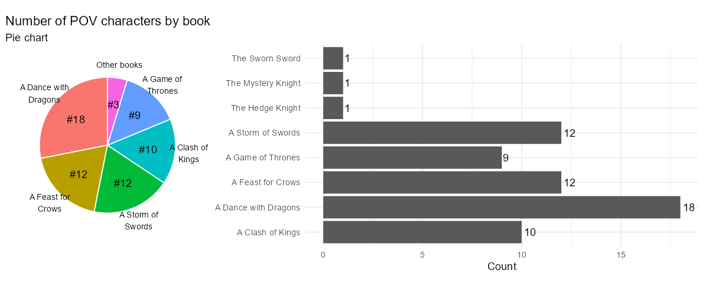

# Minna þekktar myndrænar framsetningar

Á meðan venjuleg gröf eins og súluritin, línurit og dreifirit eru algengust í gagnamiðlun, þá eru
til fleiri sérhæfð gröf sem er mikilvægt að nota rétt. Þessi gröf geta verið mjög gagnleg í ákveðnum
aðstæðum, en ef þau eru notuð í röngum tilgangi geta þau flækt skilaboðin og verið erfiðari fyrir
lesendur að skilja. Því er mikilvægt að nota þessi minni notuðu gröf sparlega og einungis þar sem
þau bæta við gagnamiðlunina.

---

## Kassarit - Box Plot

Kassarit eru oft talin vera uppáhalds graf vísindamanna vegna þess hve mikið magn upplýsinga þau
geta sýnt í einni mynd. Þau eru mjög gagnleg til að sýna dreifingu gagna og draga fram mikilvæg
tölfræðileg atriði eins og miðgildi, lágmarks- og hámarksgildi, og hvernig gögn dreifast í
fjórðungum. Þrátt fyrir að vera mjög lýsandi fyrir sérfræðinga getur almennur markhópur fundist þau
óskiljanleg og því ætti að nota þau með varúð þegar aðrir en vísindamenn eru áhorfendur.

#### Hvað er kassarit?

Kassarit—stundum kallað kassar og strokur (e. box and whisker plot)—er mynd sem sýnir ýmsar
samantektartölur í einni sýn. Kassarit sýnir:

- **Lágmarksgildi**: Minnsta gildi í gagnasafni
- **Hámarksgildi**: Hæsta gildi í gagnasafni
- **Miðgildi**: Miðjan á gögnum, eða 50. prósentan
- **Neðri fjórðungur**: Miðgildi neðri helmings gagnasafnsins, eða 25. prósentan
- **Efri fjórðungur**: Miðgildi efri helmings gagnasafnsins, eða 75. prósentan

Kassinn sjálfur sýnir fjórðungana, þar sem línan í miðjum kassanum táknar miðgildið. Strokurnar
(whiskers) sýna hámarks- og lágmarksgildi, en ef það eru útlagar (e. outliers), eru þeir sýndir sem
sérstakir punktar fyrir utan strokurnar.

#### Hvenær á að nota kassarit?

Kassarit eru gagnleg þegar þú vilt bera saman dreifingu margra gagnasafna hlið við hlið, t.d.
samanburð á einkunnum eða launadreifingu. Þau eru einnig hentug til að greina frávik og sjá hvort
dreifing er breið eða þétt.

#### Hvenær á að sleppa kassaritum?

Ef markhópurinn er ekki vel þjálfaður í tölfræði getur verið betra að nota einfaldari gröf. Kassarit
sýna ekki dreifingu eins vel og dreifirit eða stuðlarit, sem getur falið mikilvægar upplýsingar.

#### Afbrigði af kassariti

- **Breytibreið kassarit - variable width boxplot**: Kassar sýna stærð hópanna.
- **Kassarit með skörðum - notched boxplot**: Sýna öryggisbil í kringum miðgildi.
- **Fiðlurit - violin plot**: Sameina kassarit og dreifilínurit til að sýna dreifingu nákvæmlega.

Nánar um [Box Plot](https://www.storytellingwithdata.com/blog/what-is-a-boxplot) á *Storytelling
with data.*

---

## Skífurit - Pie Chart

Skífurit (eða kökurit) eru ein algengasta gerð gagnaframsetningar, en einnig ein sú mest
gagnrýnda og misnotaða. Ástæðan er einföld: augað á erfitt með að greina hlutföll á skífuritum,
sérstaklega þegar sneiðar eru svipaðar að stærð. Þrátt fyrir þetta geta skífurit verið nytsamleg í
ákveðnum tilvikum, sérstaklega þegar markmiðið er að sýna hlutfallslega skiptingu á einfaldan hátt.

#### Hvað er skífurit?

Skífurit sýnir samband hluta og heildar með því að skipta gögnum niður í sneiðar sem samsvara
hlutföllum hverrar breytu af heildinni. Allar sneiðar samanlagt mynda 100%. Þó fólk laðist að
hringforminu, sem táknar heildina, er erfitt fyrir okkur að bera saman sneiðar, sérstaklega þegar
þær eru nálægt því að vera jafnstórar.

#### Hvenær á að nota skífurit?

Skífurit hentar vel þegar þú vilt sýna hlutfall einstakra flokka í samanburði við heildina. Það er
hentugt til að sýna að einn hluti af gögnunum sé tiltölulega stærri eða minni en aðrir.

#### Hvenær á ekki að nota skífurit?

Þegar gögn þurfa nákvæman samanburð eða eru fleiri en fáir flokkar, ætti að forðast skífurit. Augað
á erfitt með að meta hlutföll af heild þegar sneiðar eru líkar að stærð. Í slíkum tilvikum er betra
að nota stöplarit eða línurit.

#### Hönnun ráðleggingar fyrir skífurit

- Forðastu 3D og sprengiskífurit (exploding pie chart) sem rugla lestur gagna.
- Notaðu ekki of margar sneiðar; samræmdu smærri flokka í „Allir aðrir.“
- Raðaðu sneiðunum eftir stærð til að auðvelda lestur.
- Settu merkingar beint á sneiðarnar í stað þess að nota skýringarlista.

Í þessum myndum er fjöldi sögupersóna með sjónarhorn (POV characters) eftir bók í _Game of Thrones_
sýndur bæði sem stöplarit og sem skífurit. Stöplarit býður upp á skýran samanburð þar sem auðvelt er
að sjá nákvæman fjölda fyrir hverja bók, sem er sérstaklega gagnlegt þegar áherslan er á nákvæmar
tölur. Skífurit dregur fram hlutfallslegan samanburð og sýnir hversu mikið hver flokkur leggur til
heildarinnar, en getur verið óljóst þegar skífurnar eru svipaðar að stærð. Þó stöplarit taki meira
pláss og sé betra til nákvæms samanburðar, getur skífurit verið meira sjónrænt aðlaðandi þegar
hlutföll skipta máli.

Nánar um [Pie Chart](http://www.storytellingwithdata.com/blog/2020/5/14/what-is-a-pie-chart) á
*Storytelling with data.*

---

## Svæðarit - Area Graph

Svæðarit eða flatarmyndrit (Area Graph) er sérstök gerð af línuriti þar sem svæðið undir línunni er
litað til að gefa til kynna magn eða heildarupphæð gagna yfir tíma. Þó að þetta virðist vera einföld
sjónræn breyting, þá hefur hún mikil áhrif á hvernig við skynjum gögnin.

#### Kostir

- Svæðarit geta verið árangursrík til að sýna hækkun og lækkun á ýmsum gagnaröðum yfir tíma.
- Þau hjálpa til við að leggja áherslu á hlutfall í heildarsamhengi þegar einn hluti er mjög stór
  eða minnkar verulega yfir tíma.
- Gott til að sýna breytingar yfir tíma þegar gögn eru skoðuð í mörgum litlum einingum (smámynda
  línurit).

#### Gallar

- Eru ekki hentug ef gagnaskalinn hefur ekki þýðingarmikið samhengi við núll.
- Þau eru erfið til að sýna margar óstöðugar gagnaröð og litlar breytingar milli gilda.
- Þegar gagnaröðir skarast getur verið erfitt fyrir áhorfendur að sjá hversu mikið tvær eða fleiri
  svæðir ná yfir sama pláss.

#### Samantekt

Þegar svæðarit eru notuð, sérstaklega í staflaðri útgáfu, getur það verið áskorun að meta hver
grunnlínan fyrir hverja gagnaröð er. Þetta gerir það oft erfiðara að túlka gögnin og leiðir til þess
að sumar upplýsingar verða faldar.

Svæðarit er því best notað í aðstæðum þar sem hægt er að forðast mikla skörun gagnaræða, og þegar
áherslan er á heildarmagn fremur en nákvæmni á milli einstakra gilda.

Nánar um [Area Graph](https://www.storytellingwithdata.com/blog/2020/4/9/what-is-an-area-graph) á
*Storytelling with data.*

---

## Kúlurit - Bubble Chart

Kúlurit er útvíkkun á dreifiriti (scatterplot) þar sem sýndar eru þrjár eða fleiri tölulegar
breytur. Hver kúlan í ritinu táknar eitt gagnapunkt, þar sem gildin fyrir hvern gagnapunkt eru
táknuð með:

1) Lárétta stöðu (x-ás)
2) Lóðrétta stöðu (y-ás)
3) Stærð kúlu

Í sumum tilvikum getur litur kúlunnar eða hreyfing í hreyfimynd táknað fleiri víddir.

#### Kostir

- Kúlurit er gott til að sýna samband milli þriggja eða fleiri breyta.
- Gefur sjónræna mynd af mismunandi stærðum og samanburði í gagnasafni.
- Hægt er að bæta við fjórðu víddinni, t.d. með lit, til að fá enn ítarlegri upplýsingar.

#### Gallar

- Flókið að túlka þegar margar víddir eru sýndar samtímis, sem getur ruglað áhorfendur.
- Erfitt að sjá smávægilegan mun á kúlunum, sérstaklega þegar breyturnar eru nálægt hver annarri.
- Ekki hentugt þegar aðeins tvær breytur eru til skoðunar; dreifirit væri betra val í þeim tilvikum.

Nánar um [Bubble Chart](https://www.storytellingwithdata.com/blog/2021/5/11/what-is-a-bubble-chart)
á *Storytelling with data.*
---

## Bullet graf

Bullet graf er afbrigði af súluritinu þar sem aðalsúla er lögð ofan á bakgrunnsstafla af minna
áberandi súlum. Bullet graf er oftast notað til að bera saman gildi, til dæmis að sýna framvindu
gagnvart markmiði eða þolmörkum. Til dæmis getur fyrirtæki viljað mæla sölutölur núverandi árs
samanborið við sett markmið eða fyrri árangur.

Bullet graf nýtir kunnugleika okkar með súluritum til að birta mikið af upplýsingum á þéttu svæði.
Ef þú vilt sýna árangur mælikvarða gagnvart markmiði eða viðmiðunarpunkti, býður bullet graf upp á
hnitmiðaða og þétta framsetningu.

#### Kostir:

- Sýnir árangur eða framvindu á áhrifaríkan hátt.
- Hentar vel til samanburðar við markmið eða viðmiðunargildi.
- Tekur lítið pláss en veitir mikið magn upplýsinga.

#### Gallar:

- Getur verið ruglingslegt fyrir óreynda notendur.
- Of mikið af litum eða upplýsingum getur gert grafið óskýrt.
- Krefst skýrra leiðbeininga til að hjálpa áhorfendum að lesa grafið rétt.

Nánar um [Bullet Graph](https://www.storytellingwithdata.com/blog/what-is-a-bullet-graph) á
*Storytelling with data.*
---

## Punktarit - Dot Plot

Punktarit er graf sem sýnir gögn með punktum eða litlum hringjum. Það eru til ýmsar útfærslur af
punktariti, en helstu gerðirnar eru:

1. **Hefðbundið punktarit:** Sýnir dreifingu gagna og getur verið gagnlegt til að sjá lögun gagna
   eða
   greina útlagapunkta.
2. **Cleveland punktarit:** Birtir magnmælingar á mörgum flokkum og er oft notað sem valkostur við
   súlurit.
3. **Tengt punktarit:** Notað til að bera saman tvær (eða fleiri) raðir af gögnum þar sem tenging
   milli
   punkta leggur áherslu á muninn eða breytingu.

#### Kostir:

- Notar minna pláss og getur því innihaldið fleiri skýringar.
- Hentar vel til að bera saman margar flokka.
- Þarf ekki að byrja á núlli eins og súlurit.

#### Gallar:

- Ekki eins algengt og súlurit, sem getur valdið ruglingi fyrir áhorfendur.
- Getur verið erfitt að lesa þegar margar raðir af gögnum eru notaðar.
- Þegar gögn eru mjög sveiflukennd, getur verið erfitt að fylgja breytingum með punktariti.

> **Athugasemd**: Punktarit er mjög skyld **hallariti** (slope graph). Báðar tegundir eru notaðar
> til að sýna breytingar á milli tveggja punkta í tíma eða milli tveggja flokka. Meginmunurinn er að
> punktarit hafa ekki endilega tengingu milli breytanna eins og hallaritin, þar sem línur milli
> punktanna leggja áherslu á breytingarnar á milli þeirra.

Nánar um [Dot Plot](http://www.storytellingwithdata.com/blog/2020/12/9/what-is-a-dot-plot) á
*Storytelling with data.*
---

## Flæðirit - Flowchart

Flæðirit er sjónræn framsetning á ferli eða verkflæði. Þau eru oft notuð til að útskýra flókin ferli
á auðskiljanlegan hátt. Í flæðiritum eru ákveðin skref skilgreind með texta og formum, eins og
rétthyrningum og tíglum, sem síðan eru tengd með línum eða örvum til að sýna rétt ferli.

#### Kostir

- **Einfaldar flókin ferli**: Flæðirit hjálpa til við að brjóta flókin ferli niður í einfaldari
  skref, sem gerir þau auðveldari til skilnings.
- **Notkun tákna**: Mismunandi form eins og tíglar fyrir ákvarðanir eða rétthyrningar fyrir aðgerðir
  gera ferlið skýrara og auðveldara að fylgja.
- **Sveigjanleiki**: Þau bjóða upp á mikinn sveigjanleika þar sem þau eru ekki bundin við fastar
  mælingar eða ása og geta verið notuð í mörgum mismunandi geirum og fyrir ýmis ferli.

#### Gallar

- **Of mikil flækja**: Ef flæðirit eru ekki vel hönnuð geta þau orðið ruglingsleg og erfitt að
  fylgja þeim, sérstaklega ef of mörg skref eða tákn eru notuð.
- **Þörf á skýrleika**: Til að þau séu gagnleg þurfa þau að vera vel hönnuð, þar sem óviðeigandi
  notkun á litum, táknum eða línum getur gert þau óskýr og erfið til skilnings.

#### Hvenær á að nota flæðirit?

Flæðirit eru notuð til að greina, hanna, skjalfesta eða stjórna ferli í mörgum geirum, þar á meðal
upplýsingatækni, framleiðslu og stjórnun. Þau hjálpa einnig við að sýna vinnuferli eða skipulag
innan fyrirtækja.

Nánar um [Flowchart](https://www.storytellingwithdata.com/blog/what-is-a-flowchart) á *Storytelling
with data.*
---

## Sankey-rit - Sankey Diagram

Sankey rit eru flæðirit sem sýna flæði gagna eða auðlinda á milli mismunandi ferla eða þrepa. Ritið
er nefnt eftir Captain Matthew Sankey, sem bjó til sitt fyrsta Sankey rit til að sýna orkutap í
gufuvél. Þau eru notuð til að sýna hvernig hlutar af gögnum eða auðlindum flæða frá einu stigi til
annars, þar sem breiddin á böndunum táknar magn hvers flæðis.

#### Kostir

- **Sýnileg tengsl**: Henta vel til að sýna flókin tengsl og flæði á milli ferla, þar sem breidd
  tenginganna táknar stærð eða magn.
- **Greining flæðis**: Góð fyrir greiningu á ferlum þar sem hægt er að bera saman magn á ýmsum
  stigum og auðkenna þætti sem gætu þurft betrumbætur.
- **Sérstaklega áhrifamikil í orkugreiningu eða auðlindaflæði**: Algengt er að nota Sankey rit til
  að sýna flæði orku, fjármagns eða annarra auðlinda, og þau eru mikið notuð í vísindum og
  verkfræði.

#### Gallar

- **Erfið í nákvæmum samanburði**: Það getur verið erfitt að bera saman breidd bandanna nákvæmlega,
  sérstaklega ef þau eru mörg og þétt saman.
- **Ofhlaðin**: Ef Sankey rit eru með mörgum stigum eða flæði getur ritið orðið ofhlaðið og erfitt
  fyrir áhorfendur að skilja það.
- **Óviðeigandi ef ekkert flæði er til staðar**: Ef gögnin sýna ekki flæði milli þrepa, er Sankey
  rit ekki rétt val og getur verið ruglingslegt fyrir áhorfendur.

#### Hvenær á að nota Sankey rit?

Sankey rit eru best notuð þegar þú vilt sýna hvernig flæði af tilteknum gögnum dreifast á milli
ferla eða þrepa. Þau eru tilvalin til að sýna hlutfall milli flæði á ýmsum stigum, eins og í ferli
við ráðningar eða auðlindadreifingu innan fyrirtækis.

Nánar um [Sankey Diagram](https://www.storytellingwithdata.com/blog/what-is-a-sankey-diagram) á
*Storytelling with data.*
---

## Köngulórit - Spider Chart

Köngulóarrit er notað til að sýna gögn yfir margar mismunandi víddir. Hver vídd hefur sitt hámarks-
og lágmarksgildi, og gögnin eru sýnd með línum sem tengjast í kringlótt form. Köngulóarrit eru oft
notuð til að bera saman frammistöðu á mörgum sviðum á sama tíma, t.d. til að meta frammistöðu
íþróttamanna eða vörueiginleika í matvæla-vísindum.

#### Kostir

- **Sýnir margþætta vídd**: Köngulóarrit er gott til að sýna gögn yfir margar víddir á mjög þéttu
  svæði.
- **Áhugavekjandi framsetning**: Vegna kringlóttu uppsetningarinnar og þess að þau eru sjaldgæfari
  en önnur gröf, vekja þau athygli og eru áberandi.

#### Gallar

- **Erfið í lestri**: Þar sem áhorfendur þurfa að bera saman flatarmál margra óreglulegra forma geta
  verið flókin að lesa og skilja.
- **Skaðleg stærðaraukning**: Gildi sem eru lengra frá miðju virðast sjónrænt stærri en þau eru í
  raun vegna þess að flatarmálið vex hratt eftir því sem lína færist fjær miðju.

> *Athugasemd*: Köngulóarrit tengjast hallaritum þar sem bæði ritin sýna samanburð á mörgum
> víddum en hallaritið leggur meiri áherslu á breytingar milli tveggja tímabila.

Nánar um [Spider Chart](https://www.storytellingwithdata.com/blog/2021/8/31/what-is-a-spider-chart)
á *Storytelling with data.*
---

## Rúðurit - Square Area Chart

Rúðurit (square area chart) eða jafnvel kallað vöfflurit (waffle chart), er myndræn framsetning þar
sem gögn eru sett fram sem reglulegt 10x10 net, eða möskvi, með 100 stökum einingum.
Hver eining er lituð í samræmi við gögnin sem á að sýna. Þetta rit er oft notað til að sýna hlutföll
innan heildar, þar sem hver eining táknar ákveðið hlutfall.

#### Kostir

- **Auðvelt að bera saman**: Rúðurit býður upp á skýrari samanburð en skífurit, þar sem reglulegar
  einingar eru auðveldari að meta.
- **Sjónrænt áhugavert**: Vegna sjaldgæfni getur rúðurit verið sjónrænt áberandi í kynningum og
  vakti athygli.
- **Hentar fyrir stór gögn**: Rúðurit leyfir samanburð á tölum af mismunandi stærðargráðum á skýran
  og skipulagðan hátt.

#### Gallar

- **Vantar nákvæmni fyrir smá gögn**: Ef gildi eru mjög lítil eða ekki heilar tölur getur þurft að
  umreikna eða sleppa ákveðnum gildum, sem getur skekkt framsetningu.
- **Óalgengt og getur ruglað áhorfendur**: Sumir áhorfendur gætu átt erfitt með að lesa rúðurit þar
  sem það er minna þekkt en hefðbundin gröf eins og línurit eða súlurit.

#### Samantekt

Rúðurit er öflug myndræn framsetning sem hentar vel þegar sýna á hlutföll innan heildar. Það er
sérstaklega gagnlegt þegar þörf er á að bera saman stór gögn, en getur verið ruglingslegt fyrir
áhorfendur sem eru óvanir þessari gerð grafík. Þegar það er notað á réttan hátt getur rúðurit verið
bæði áhrifamikið og nákvæmt.

Nánar um [Square Area Chart](https://www.storytellingwithdata.com/blog/what-is-a-square-area-chart)
á *Storytelling with data.*
---

## Trémynd - Treemap

Trémynd, þróuð af Dr. Ben Shneiderman á tíunda áratugnum, er myndræn framsetning sem notar
rétthyrninga til að sýna hlutfallsleg gildi í flóknu stigveldi. Stærð rétthyrninganna er í réttu
hlutfalli við gögnin sem þau tákna. Trémyndir eru sérstaklega gagnlegar til að sýna samband milli
heildar og einstakra þátta í stórum gagnasettum.

### Kostir

- **Sýnir hlutföll vel**: Trémyndir eru frábærar til að sýna hlutföll margra flokka innan heildar.
- **Nýtir skjápláss vel**: Trémyndir geta sýnt mikið af gögnum á lítilli skjástærð.
- **Gagnleg fyrir stigveldi**: Sérstaklega gagnlegt fyrir gögn sem hafa marglaga stigveldi, eins og
  möppur í tölvu eða sölutölur í mismunandi löndum og borgum.

### Gallar

- **Erfitt að lesa fyrir óvana**: Áhorfendur sem þekkja ekki trémyndir gætu átt erfitt með að lesa
  þær rétt án skýringa.
- **Samanburður er óskýr**: Það getur verið erfitt að bera nákvæmlega saman stærðir rétthyrninga,
  sérstaklega þegar þeir eru líkir að stærð.
- **Takmarkanir fyrir gögn**: Trémyndir geta aðeins sýnt jákvæð gildi og henta ekki fyrir gögn með
  núll eða neikvæðum gildum.

### Samantekt

Trémyndir eru áhrifarík myndræn framsetning til að sýna hlutföll og stigveldi innan stórra
gagnasetta. Þær eru þó ekki alltaf besti kosturinn fyrir nákvæman samanburð og geta verið
ruglingslegar fyrir áhorfendur sem eru ekki vanir þessari gerð grafa.

Nánar um [Treemap](https://www.storytellingwithdata.com/blog/what-is-a-treemap) á *Storytelling with
data.*
---

## Einingarit - Unit Chart

Einingarit (unit charts) eru myndræn framsetning þar sem einstakar einingar—s.s. geometrísk form,
tákn eða myndir—eru notaðar til að tákna magn. Hver eining táknar ákveðið gildi, og magnið er táknað
með fjölda eininga. Dæmi um einingarit eru ISOTYPE-grafík, rúðurit (vöfflurit) og myndrit.
Einingarit eru oft notuð í fjölmiðlum, auglýsingum og upplýsingaritum.

## Kostir

- **Sjónræn skýrleiki**: Einingarit eru oft auðveld að skilja þar sem táknin eru oft augljós og
  vekja athygli. Þetta gerir þau sérstaklega hentug fyrir almenna áhorfendur.
- **Sýna hlutföll vel**: Einingarit eru góð til að sýna hlutföll, sérstaklega þegar hver eining
  táknar tiltekinn hluta af heild.
- **Manneskjuleg tenging**: Þegar tákn eða myndir tengjast einstaklingum, minna einingaritin á að
  gögnin tengjast raunverulegum manneskjum, ekki bara tölum.

## Gallar

- **Óhefðbundin framsetning**: Sumir áhorfendur gætu ekki verið vanir einingaritum og gætu talið þau
  vera „grafíska sóun“ eða barnalega framsetningu á gögnum.
- **Takmarkað magn upplýsinga**: Þegar margar víddir eða flókin gögn eru til staðar, geta einingarit
  verið óskýr eða ruglingsleg, sérstaklega ef táknin eru óregluleg eða erfið að lesa.
- **Þörf á samræmdri stærð**: Táknin verða að vera af sömu stærð til að samanburður sé réttur.
  Misjafn stærð tákna getur leitt til rangra túlkunar.

## Samantekt

Einingarit eru áhrifarík myndræn framsetning þegar þörf er á að sýna magn með auðveldum og skýrum
hætti. Þau henta vel fyrir almennan áhorfendur eða þegar tengja á gögn við manneskjur. Hins vegar
geta þau verið óhentug þegar gögnin eru flókin eða þarfnast nákvæmari framsetningar, þar sem þau
geta orðið of einföld eða ruglingsleg fyrir flóknar greiningar.

Nánar um [Unit Chart](https://www.storytellingwithdata.com/blog/what-is-a-unit-chart) á
*Storytelling with data*.

---

## Aðrar myndrænar framsetningar

Þessar framsetningar sem hafa verið nefndar hér að ofan eru aðeins brot af þeim myndrænu
framsetningum sem hægt er að nota til að sýna gögn. Þetta er ekki tæmandi listi, og margir aðrir
möguleikar eru í boði eftir því hvaða gögn þarf að tjá og hvaða skilaboð ætlunin er að koma á
framfæri. 

Þegar gögn eru flókin eða margþætt er gott að skoða hvaða framsetning hentar best til að miðla
upplýsingunum á skýran og skilvirkan hátt. Val á réttu myndrænu framsetningunni getur haft mikil
áhrif á það hvort áhorfendur skilja gögnin rétt og ná nauðsynlegum innsýn úr þeim.
